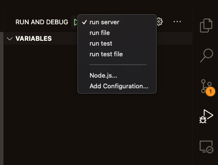

# get-started-express

Setup for Express with typescript application.

## Getting Started

These instructions will get you a copy of the project up and running on your local machine.

```
cat .env.example >> .env
npm install
npm run watch
```
## Scripts

- `npm run build` -> Build typescript application to `dist` folder.
- `npm start` -> Run application, the application needs by built.
- `npm run watch` -> Run application and do restart with changes.
- `npm run test` -> Run test with coverage.
- `npm run test:watch` -> Run test and reload with changes.
- `npm run doc` -> Open API documentation.
- `npm run lint` -> List issues captured by lint.
- `npm run lint:fix` -> Fix some issues of lint.

## Debugging

If you use [Visual Studio Code](https://code.visualstudio.com) and you want use debug, the project already have [launch.json](.vscode/launch.json) with some configs.



- `run server` -> Run application.
- `run file` -> Run a typescript file.
- `run test` -> Run test.
- `run test file` -> Run a test file.

## License

This project is licensed under the MIT License - see the [LICENSE](LICENSE) file for details.
